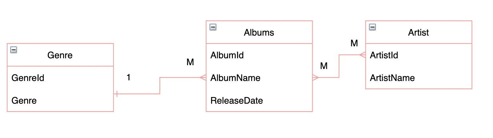

# Spring Relations Lab

* Create three packages for Artist, Album and Genre(type of music).

* Each package should have module, controller, service and repository class. 

* The module class for Artist, Album and Genre should have the following attributes:

* Create the following in each controller and service:
    * Get: to get all (Artist or Album or Genre)
    * Post to add (Artist or Album or Genre)

 

*  Create `Many to Many` relationship between Artist and Albums (each album can have many artist and each artist can have many albums)
* Create post request where you can add artists to an album. 

* Create `Many to One` relationship between Album and Genre (each album can have one genre and each genre can have many albums)
* Create post request where you can add a genre to an album. 